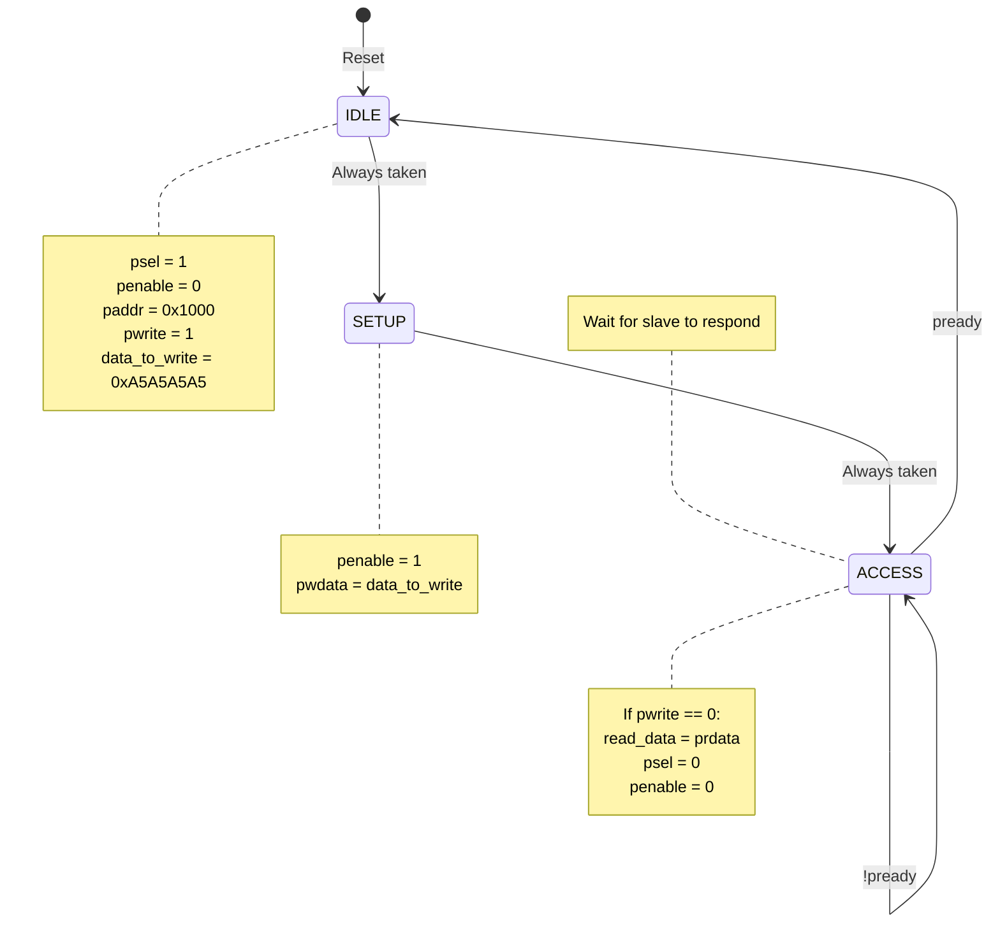

# APB Protocol implementation

Master module state diagram

```mermaid
stateDiagram-v2
    [*] --> IDLE: Reset
    
    IDLE --> SETUP: Always taken
    note right of IDLE
        psel = 1
        penable = 0
        paddr = 0x1000
        pwrite = 1
        data_to_write = 0xA5A5A5A5
    end note
    
    SETUP --> ACCESS: Always taken
    note right of SETUP
        penable = 1
        pwdata = data_to_write
    end note
    
    ACCESS --> ACCESS: !pready
    note left of ACCESS
        Wait for slave to respond
    end note
    
    ACCESS --> IDLE: pready
    note right of ACCESS
        If pwrite == 0:
            read_data = prdata
        psel = 0
        penable = 0
    end note
```
